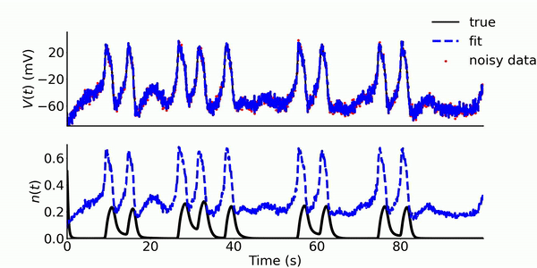
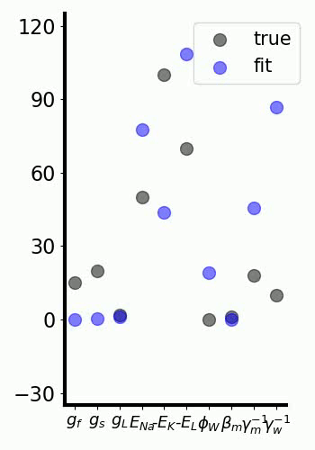

## *Variational annealing*: Fitting electrophysiological recordings to nonlinear neuron models 




This repository fits single-neuron intracellular electrophysiological recordings to arbitrary neuron models of interest, by applying the technique of *variational annealing*,  a nonlinear model-fitting algorithm outlined by Ye, Kadakia et al [in this paper](https://npg.copernicus.org/articles/22/205/2015/npg-22-205-2015-discussion.html) , further in explored [here](https://journals.aps.org/pre/abstract/10.1103/PhysRevE.92.052901), and also [applied](https://link.springer.com/article/10.1007/s00422-016-0697-3) to neurons in the avian song system. *Variational annealing* iteratively optimizes a cost function that balances errors between a dynamical model (model errors) and sparsely measured data (observation errors). The cost function is minimized using Quasi-Newton optimization routines for high-dimensional cost functions, such as the [BFGS]([https://en.wikipedia.org/wiki/Broyden%E2%80%93Fletcher%E2%80%93Goldfarb%E2%80%93Shanno_algorithm](https://en.wikipedia.org/wiki/Broyden–Fletcher–Goldfarb–Shanno_algorithm)) method. The result is both an estimate of the time course of the observed (voltage) and unobserved (gating variables, calcium concentrations, etc.) states, in addition to static parameters (conductances, time constants, etc.).

Quasi-Newton routines require the first derivatives of the cost function. One option is to use finite differences, but these introduce sensitivities and round-off errors, and are computationally expensive. Coding the derivatives by hand is prohibitive and error-prone except for the most rudimentary models. Instead, this code uses a purely Pythonic implementation of [automatic differentiation](https://en.wikipedia.org/wiki/Automatic_differentiation). This only requires the user to code the model equations, with full numpy functionality at their disposal. 

## Usage

### Prerequisites

To run the scripts, the following must be installed:

1. Python 3 (tested on version 3.7.7)
2. SciPy (tested on version 1.5.0)
3. NumPy (tested on version 1.19.1 )
4. [VarAnneal](https://github.com/niragkadakia/varanneal), a Python implementation of variational annealing that utilizes automatic differentiation. Use the forked repo from my github.
5. [PYADOLC](https://github.com/b45ch1/pyadolc), a Python implementation of automatic differentiation; needed for varanneal. 

To install items 4 and 5, follow the instructions in the VarAnneal repository readme. To run the plotting script, which creates a video, python opencv (cv2) must also be installed.

### Run an example estimation of a Morris-Lecar neuron

Examples for the 2D Morris-Lecar neural system are in the scripts/ folder. This script is intended to be run many times in parallel, each with a different initialization for the optimization/annealing routine. Fuller explanation for the variational annealing algorithm can be found in the VarAnneal repository Readme. To run the script with seed 0:

```
$ cd scripts
$ python morris_lecar_all_params.py 0
```

In this script, the model is defined equations are set by:

```python
anneal1.set_model(ML_est_all_params, D)
```

Current models are saved in src/est_funcs.py. Once this script is run, results for the estimated path and estimated parameters will be saved in the data/results/all/ subfolder. 

Once this has been done for a number of seeds, say 1000, the optimal estimate can be plotted with the scripts/plot_est.py script:

```
$ cd scripts
$ python plot_est.py
```

